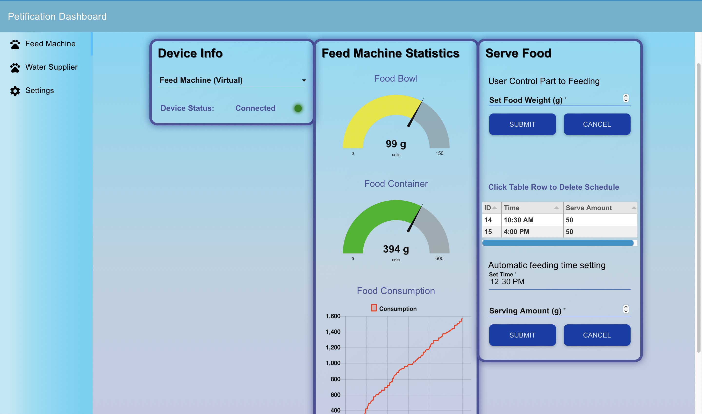
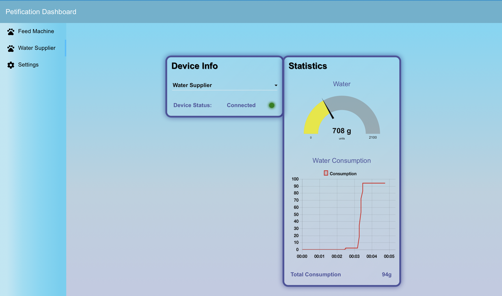
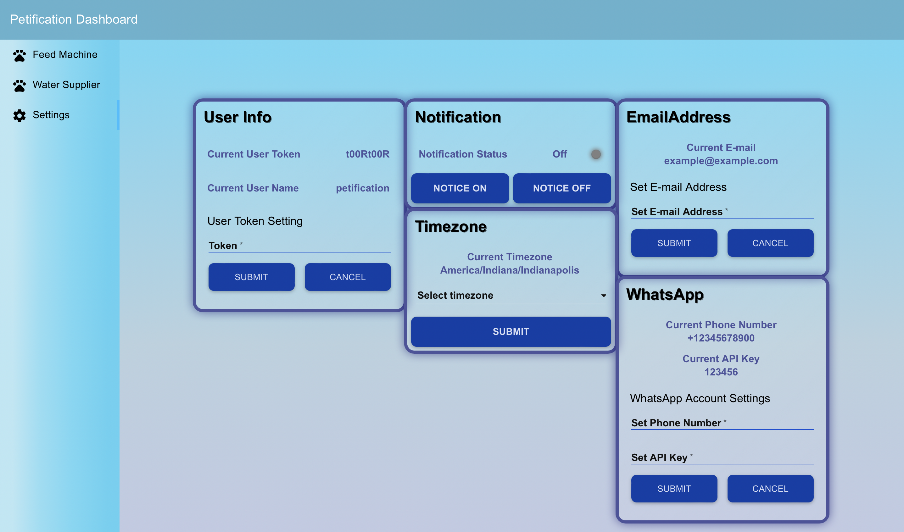

# Petification IoT
Open-source IoT Solution for pet care services

 

 

## Features
- Supplying water with Water Supplier device.
- Feeding the pet with Feed Machine device.
- Tracking water and food consumption.
- Tracking water and food remaining amount for each devices.
- Serving the food by manually or scheduled time.
- Notifying when water or food is empty.
- Providing the device conectivity.
- Displaying visual data with web based dashboard.
- Multi device support.
- Multi user support.

## Screenshots
### Feed Machine

### Water Supplier

### User Setting

## Latest Releases
- Platform: [v1.0.0](https://github.com/petification/platform/releases/tag/v1.0.0)
- Device: [v1.0.1](https://github.com/petification/device/releases/tag/v1.0.1)

## Licenses
This project is released under [MIT License](./LICENSE)

## Acknowledge
The authors would like to appreciate the support of Chungnam National University, Software-oriented university council, Purdue University and Institute for Information & communication Technology Planning & evaluation(IITP). Especially, the authors of this study are grateful to Professor Minsun Lee of Chungnam National University, Professor Eric Matdon and Anthony Smith of Purdue University, and Ph.D Minji Lee for helping us participate in the project.
